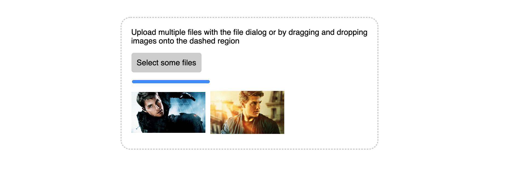

# dom-mutation
Reacting to DOM changes with MutationObserver API
   
## Fetch API
- GitHub Gist API
    - https://developer.github.com/v3/gists/

## FileReader API to Upload Image and Text Files
- Single file upload
- Multiple file upload
- File reader allows uploads file using drag and drop
- Save file reference for offline users
- Restrict files upload quantity
- Restrict files size limit
- Provides file’s mimetype information
- Allows to creates images thumbnail preview
- Allow upload text file from client side
- Helps to display file upload progress
- Allow uploading any type of File or Blob

## Image uploads with Cloudinary
- http://getcontenttools.com/tutorials/image-uploads-with-cloudinary
- https://cloudinary.com/documentation/image_upload_api_reference

## Mutation Observer API
- Detect When a Node is Inserted
- Detect When a Node is Removed
- Detect Attribute Changes
